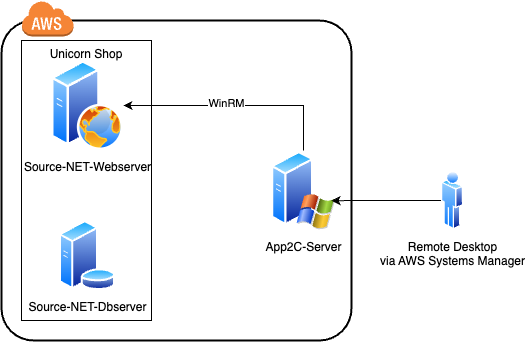

## remote
https://aws.amazon.com/jp/blogs/news/modernize-java-and-net-applications-remotely-using-aws-app2container/


### Source-NET-Webserverのセキュリティグループのインバウンドルール追加
タイプ:WinRM-HTTPS

ソース:インスタンス(App2C-Server)のセキュリティグループ

### App2Containerの初期設定
```
app2container init
```
- 入力：S3バケット名（コンテナイメージやアーティファクトをアップロードする先）

- 結果：設定ファイル（config.json）が作成され、A2Cが利用可能になる

### リモートターゲットを設定
```
app2container remote configure
```
- 入力：
    - NETWebAppIPAddress：ターゲットサーバーのIP
    - シークレットARN：認証情報を格納したAWS Secrets ManagerのARN
- 結果：ターゲットにA2Cエージェントを設定し、リモート操作が可能になる

### ターゲットサーバー上のアプリケーションを検出
```
app2container remote inventory --target <NETWebAppIPAddress>
```
- 結果：C:\Users\Administrator\AppData\Local\app2container\remote\{NETWebAppIPAddress}\inventory.jsonにアプリ一覧が出力される

### 指定アプリの詳細分析
```
app2container remote analyze --target <NETWebAppIPAddress> --application-id <application-id>
```
- 結果：C:\Users\Administrator\AppData\Local\app2container\remote\{NETWebAppIPAddress}\[application-id]\analysis.jsonにアプリの構成情報（sitePhysicalPathなど）が出力される。

### ターゲットからアプリのバイナリや設定を抽出
```
app2container remote extract --target <NETWebAppIPAddress> --application-id <application-id>
```
- 結果：ZIPアーカイブが生成される（{application-id}.zip）。

### 抽出したアプリをDockerイメージ化
※Next Step:で表示されたコマンドを実行すればいい
```
app2container containerize --input-archive C:\Users\Administrator\AppData\Local\app2container\remote\{NETWebAppIPAddress}\{application-id}\{application-id}.zip
```
- 結果：Dockerfileとイメージが生成される

### デプロイ用テンプレート生成
```
app2container generate app-deployment --application-id [application-id]
```
結果：
- ECS/EKS用のCloudFormationテンプレート
- Kubernetes YAML
- CI/CDパイプライン設定ファイル
