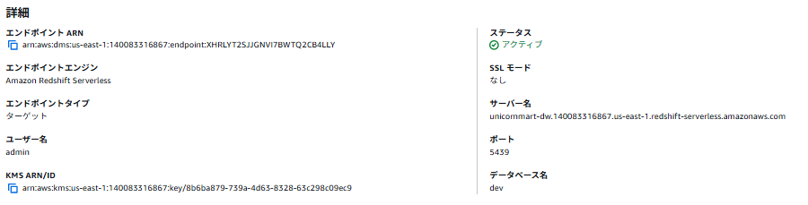

## ソースエンドポイント
### MySQL
パラメータグループのbinlog_formatの値をROWにする

同期させてからタスク開始

### PostgreSQL
パラメータグループのlogical_replicationの値を1にする

同期させてからタスク開始

### Oracle
#### CDC
- 以下のSQLをOracleで実行
```
BEGIN
    rdsadmin.rdsadmin_util.alter_supplemental_logging(
    p_action => 'ADD'
    );
END;


BEGIN
    rdsadmin.rdsadmin_util.alter_supplemental_logging(
    p_action   => 'ADD',
    p_type     => 'PRIMARY KEY'
    );
END;
```
- YESになっているかを確実
```
SELECT supplemental_log_data_min,
        supplemental_log_data_pk
FROM v$database;
```


## ターゲットエンドポイント
### S3
※ロールにS3FullAccessとKMSの権限をアタッチする

#### csv
追加の接続属性(カラム名を含めたcsvファイルを出力)
```
addColumnName=True;compressionType=NONE;csvDelimiter=,;csvRowDelimiter=\n;datePartitionEnabled=false;
```
#### parquet
- エンドポイント設定で以下のJSON
```
{
  "CsvRowDelimiter": "\\n",
  "CsvDelimiter": ",",
  "CompressionType": "NONE",
  "DataFormat": "parquet",
  "EnableStatistics": true,
  "DatePartitionEnabled": false
}
```

### Redshift Serverless
- IAMロールを作成しておく
    - ロール名: dms-access-for-endpoint(重要)
    - 信頼ポリシー
    ```
    {
        "Version": "2012-10-17",
        "Statement": [
            {
                "Sid": "Statement1",
                "Effect": "Allow",
                "Principal": {
                    "Service": [
                        "dms.amazonaws.com",
                        "redshift.amazonaws.com"
                    ]
                },
                "Action": "sts:AssumeRole"
            }
        ]
    }
    ```
    - 権限
        - AmazonRedshiftFullAccess
        - AmazonS3FullAccess
        - kms
- dms-access-for-endpointロールをRedshiftの名前空間に関連付ける


- サーバー名はワークグループのエンドポイントをコピーする

