## keycloakでログイン
https://argo-cd.readthedocs.io/en/stable/operator-manual/user-management/keycloak/

### 前提条件
- argocd,keycloakをalb(443)で公開
    - argocd: https://argocd.oyaizu.handson.toro.toyota
    - keycloak: ttps://keycloak.oyaizu.handson.toro.toyota
        - realms名: platform
- セキュリティグループで全許可

### kyecloak側の設定
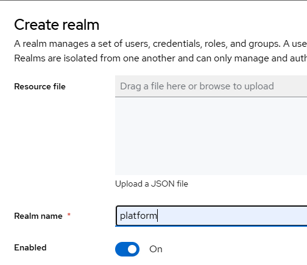
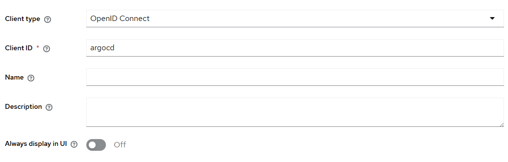
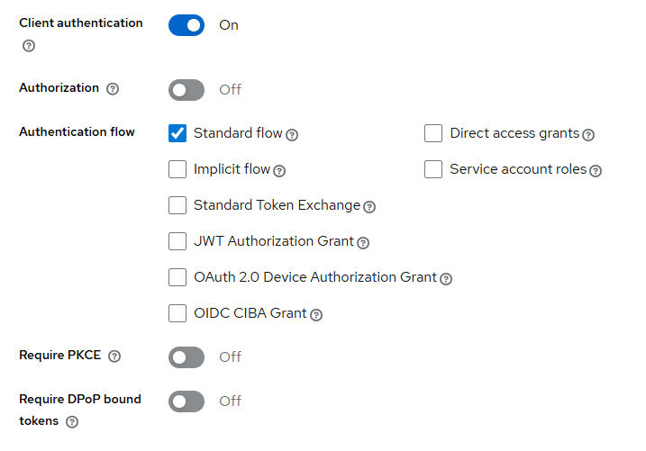
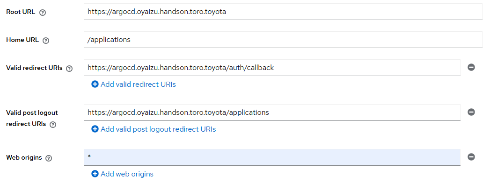
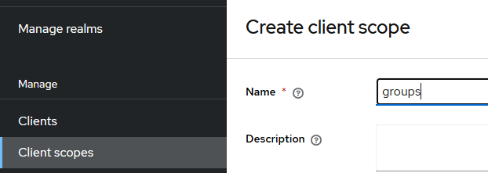
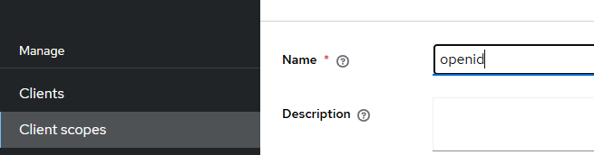
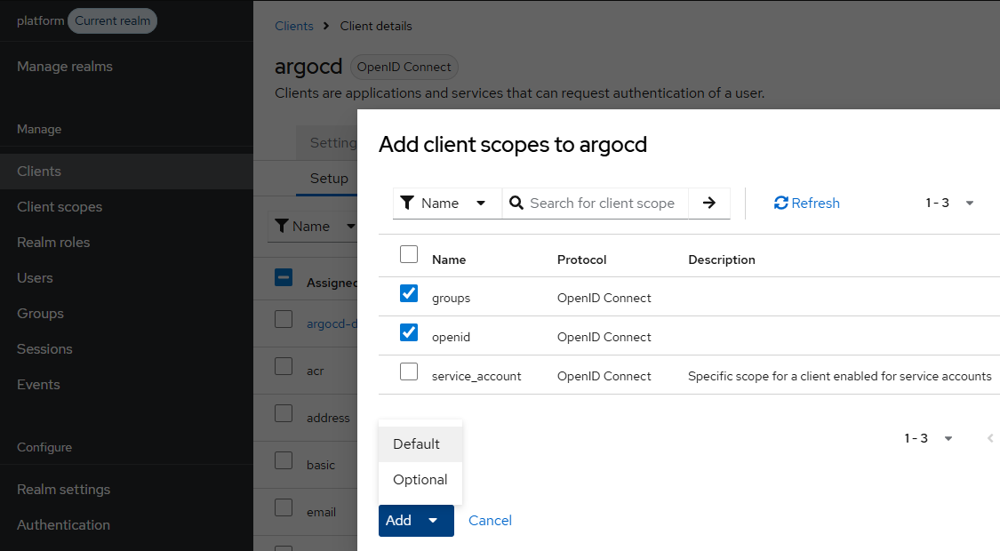
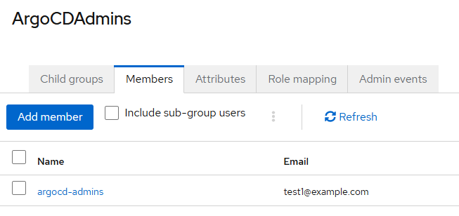
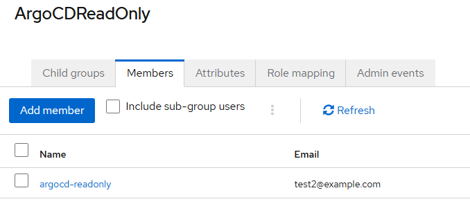
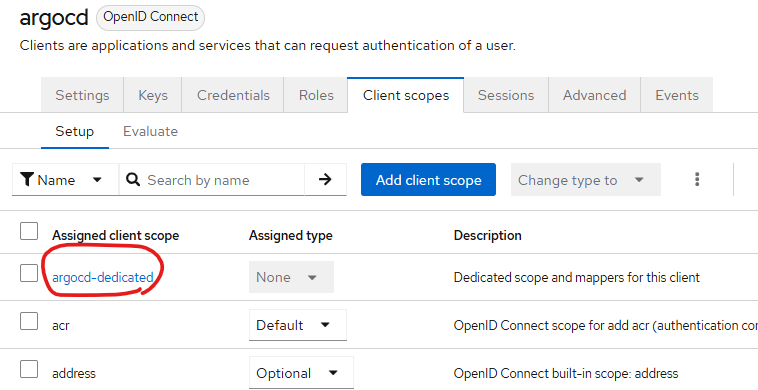
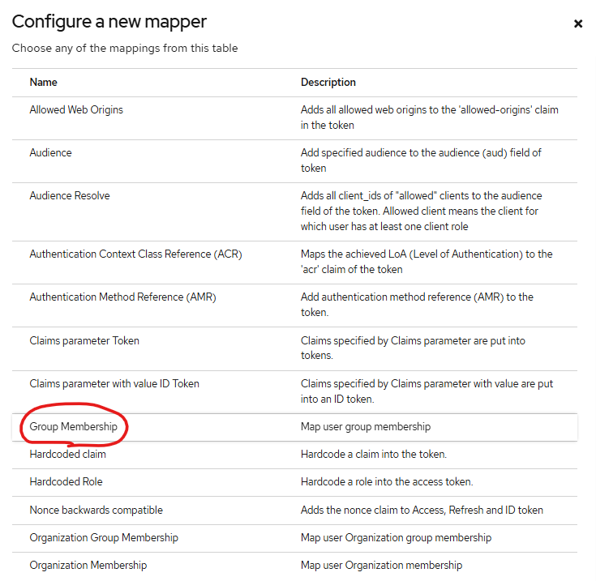
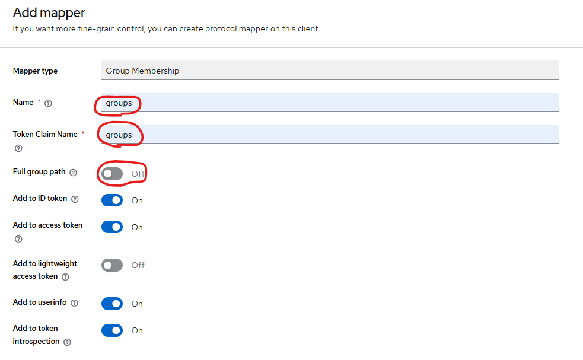
**クライアントシークレットをコピー**

### argocd側の設定
#### ArgoCD OIDCの設定
```
kubectl -n argocd patch secret argocd-secret --patch='{"stringData": { "oidc.keycloak.clientSecret": "<REPLACE_WITH_CLIENT_SECRET>" }}'
```
```
KUBE_EDITOR=vi  kubectl edit configmap argocd-cm -n argocd
```
```
data:
  url: https://argocd.oyaizu.handson.toro.toyota
  oidc.config: |
    name: Keycloak
    issuer: https://keycloak.oyaizu.handson.toro.toyota/realms/platform
    clientID: argocd
    clientSecret: $oidc.keycloak.clientSecret
    refreshTokenThreshold: 2m
    requestedScopes: ["openid", "profile", "email", "groups"]
    insecureSkipVerify: true
```

#### ArgoCDポリシーの設定
```
KUBE_EDITOR=vi kubectl edit configmap argocd-rbac-cm -n argocd
```

```
apiVersion: v1
data:
  policy.csv: |
    g, ArgoCDAdmins, role:admin
    g, ArgoCDReadOnly, role:readonly
```

#### 再起動
``` 
kubectl rollout restart deployment -n argocd
```