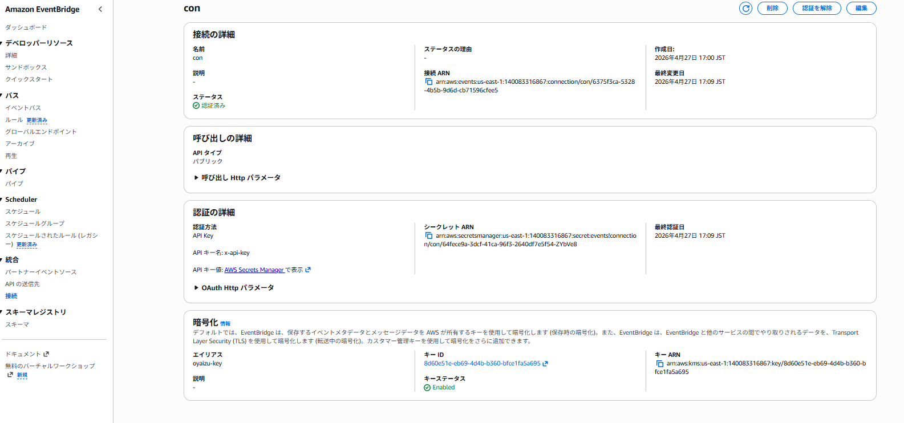

## EventBridgeのカスタムパターンでルーティング
https://docs.aws.amazon.com/ja_jp/eventbridge/latest/userguide/eb-create-pattern-operators.html


## API接続

### 暗号化している場合
- キーポリシーでサービスロールを許可する
```
arn:aws:iam::{アカウントID}:role/aws-service-role/apidestinations.events.amazonaws.com/AWSServiceRoleForAmazonEventBridgeApiDestinations"
```
