## keycloak
https://qiita.com/gaichi/items/4e58d1d1c3ad4a024ffd

### AWSのSAML用メタデータ取得
- https://signin.aws.amazon.com/static/saml-metadata.xml
    - ローカルに保存

### keycloak側の設定
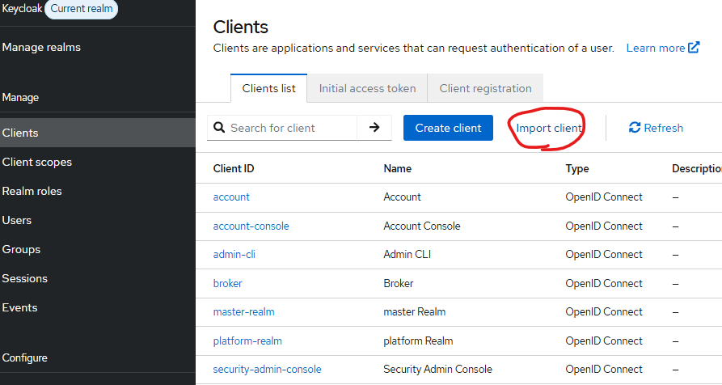

- 保存したsaml-metadata.xmlを使用

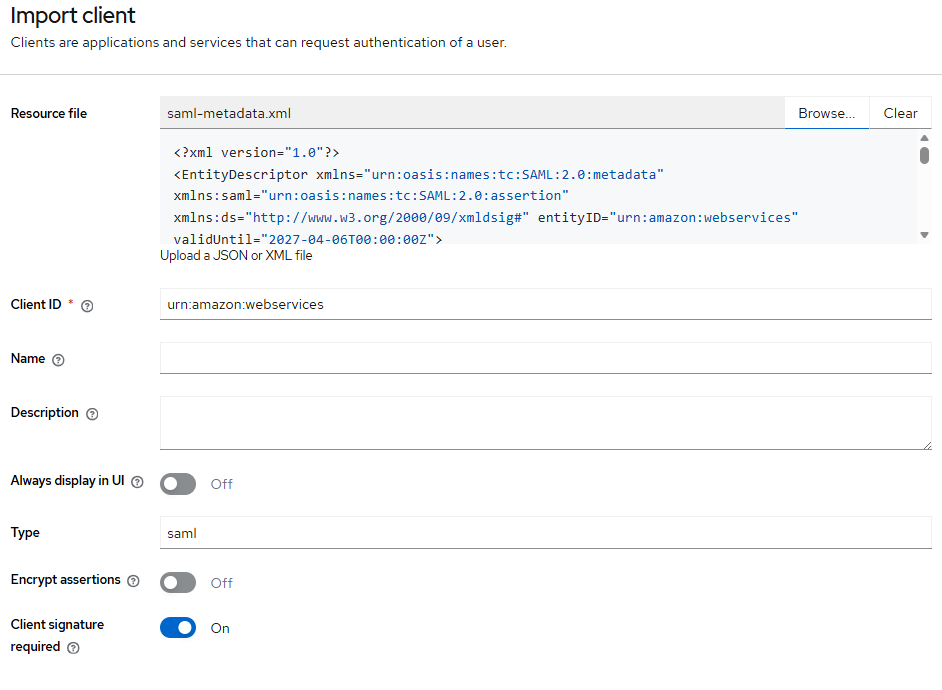

- Root URL: https://<keycloakのホスト名>
- Home URL: /realms/master/protocol/saml/clients/aws-saml
- IDP-Initiated SSO URL name: aws-saml

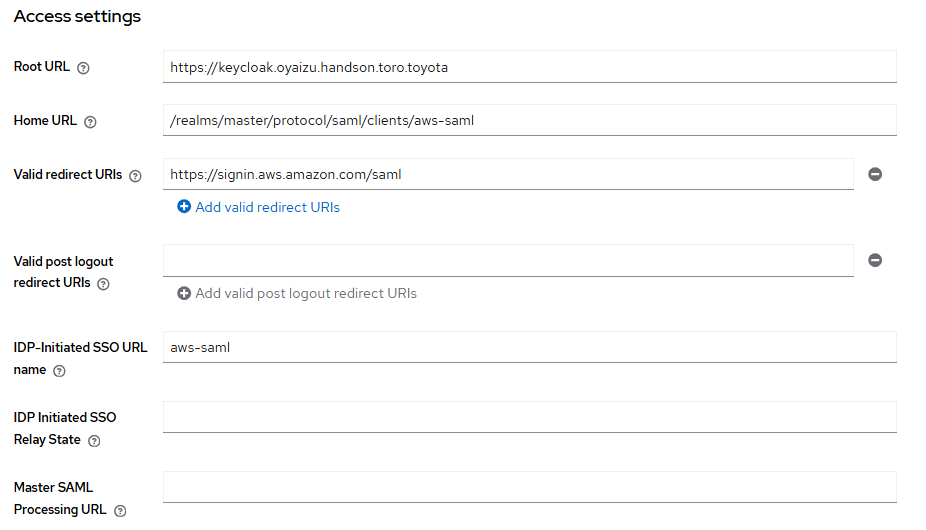

- ローカルに保存

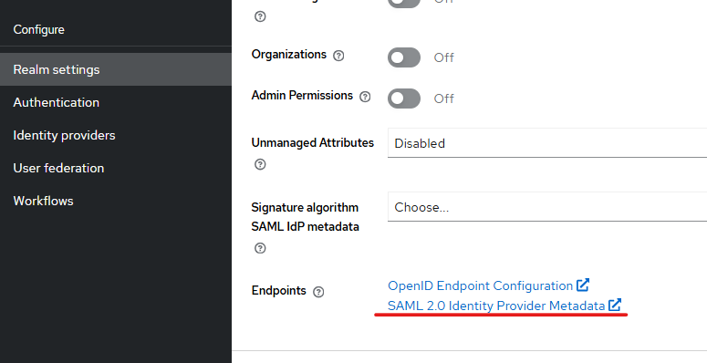

### AWS IAM設定

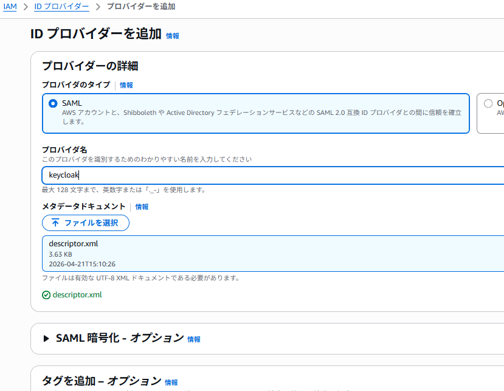
- ロール作成
    - ロールとプロバイダのARNをコピー

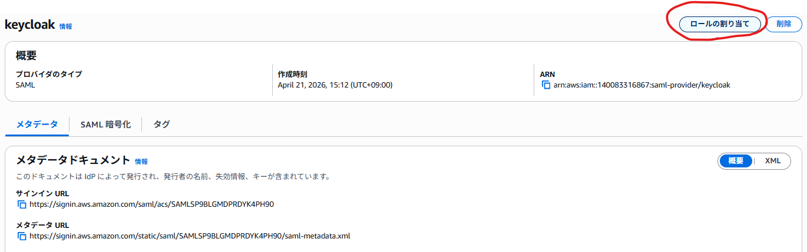

### keycloak側の設定(2)
- client(urn:amazon:webservices)にロール作成
    - 「ロールのARN,IDプロバイダのARN」

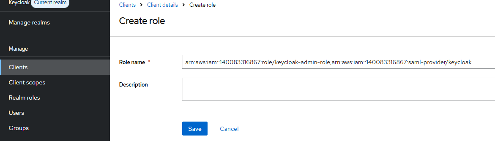

- クライアントスコープ削除

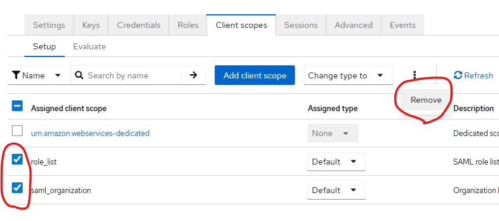

- urn:amazon:webservices-dedicatedの「RoleSessionName」「Role」を削除

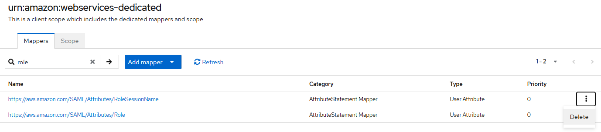

- mapper作成

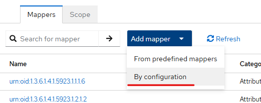
- Session Role
    - Mapper type: Role list
    - Name: Session Role
    - Role attribute name: https://aws.amazon.com/SAML/Attributes/Role
    - Friendly Name: Session Role
    - SAML Attribute NameFormat: Basic
    - Single Role Attribute: On

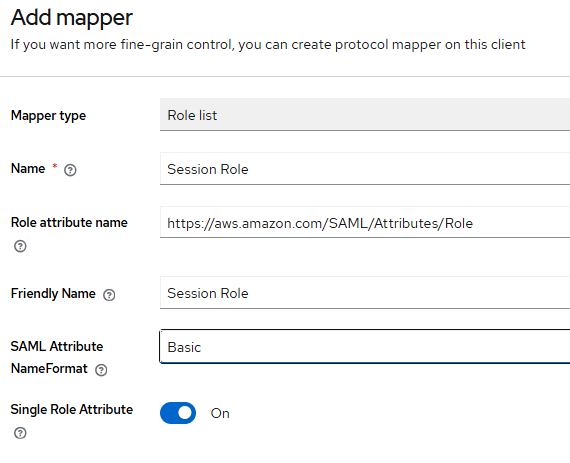

- Session Role
    - Mapper type: User Property
    - Name: Session Name
    - Property: usernmae
    - Role attribute name: https://aws.amazon.com/SAML/Attributes/RoleSessionName
    - Friendly Name: Session Name
    - SAML Attribute NameFormat: Basic

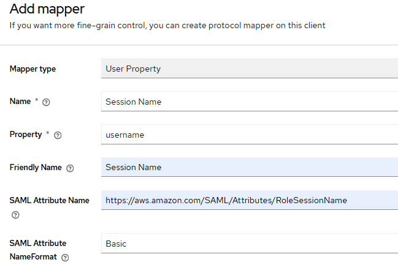

- Full scope allowedをOffにする

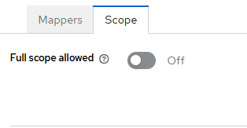

- GoupとUserを作成し、グループに参加させる

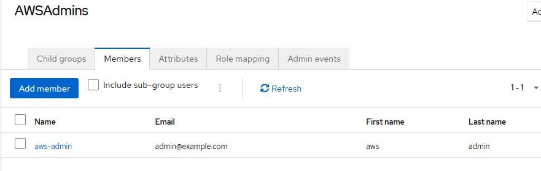

- グループにロールをマッピングする

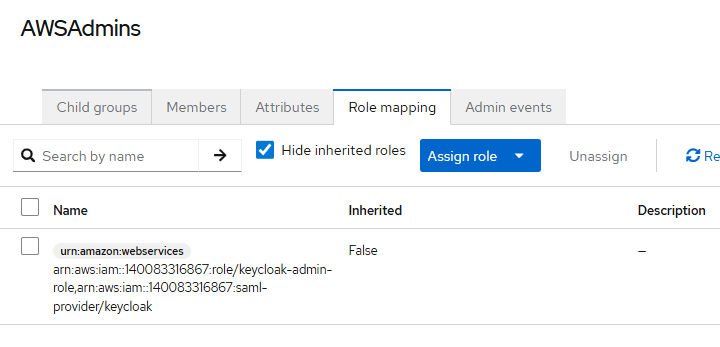

### 確認
- https://<keycloakホスト名>/realms/master/protocol/saml/clients/aws-saml 
    - 作成したユーザーでログインする → マッピングしたロールでログインされる 

## github
### 手順
https://zenn.dev/kou_pg_0131/articles/gh-actions-oidc-aws

/realms/platform/protocol/saml/clients/aws-saml