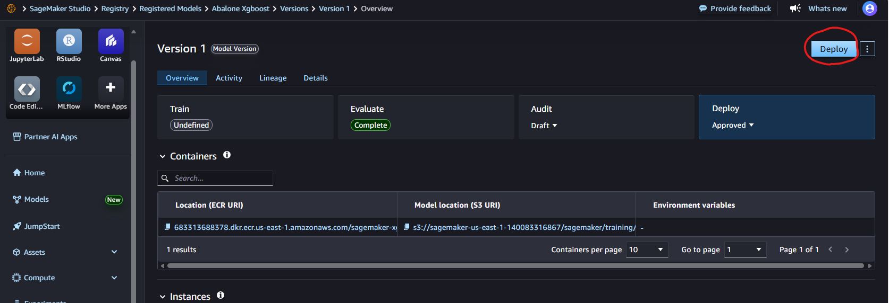

### ターミナルで以下のコマンド実行
※依存関係問題解消のため
```
pip uninstall -y \
  sagemaker sagemaker-core sagemaker-train sagemaker-serve sagemaker-mlops sagemaker_schema_inference_artifacts \
  autogluon-multimodal autogluon-timeseries \
  sparkmagic sagemaker-studio-analytics-extension \
  transformers
```
```
pip install \
  "sagemaker==2.245.0" \
  "boto3==1.37.1" "botocore==1.37.1" \
  "s3fs==2024.12.0" "aiobotocore==2.21.1" \
  "pandas>=2.3.1" "numpy>=1.26.4" "scikit-learn>=1.7.1" \
  "xgboost==2.1.4" \
  "graphene"
```


### エンドポイント作成


### 推論実行
#### InferenceComponentName取得
```
aws sagemaker list-inference-components   --endpoint-name {エンドポイント名}   --region {リージョン}
```
#### pythonコード
```python
import json
import os
import boto3

runtime = boto3.client("sagemaker-runtime")
ENDPOINT_NAME = os.environ["ENDPOINT_NAME"]
INTERFACE_COMPONENT_NAME = os.environ["INTERFACE_COMPONENT_NAME"] # コマンドで取得した値

def lambda_handler(event, context):
    body = json.loads(event["body"])
    payload = body["payload"]  # 例: "0.5,0.44,0.15,0.08,0.2,0.07,0.09,0.05"

    response = runtime.invoke_endpoint(
        EndpointName=ENDPOINT_NAME,
        InferenceComponentName=INTERFACE_COMPONENT_NAME,
        ContentType="text/csv",
        Body=payload.encode("utf-8")
    )

    result = response["Body"].read().decode("utf-8").strip()

    return {
        "statusCode": 200,
        "body": json.dumps({"score": float(result)})
    }
```