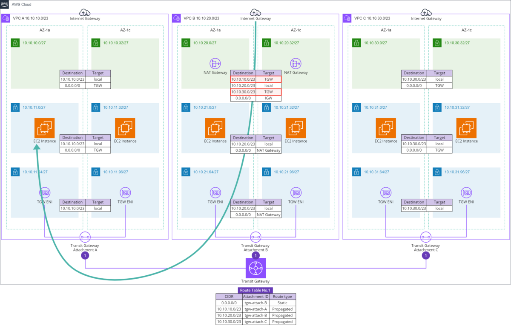
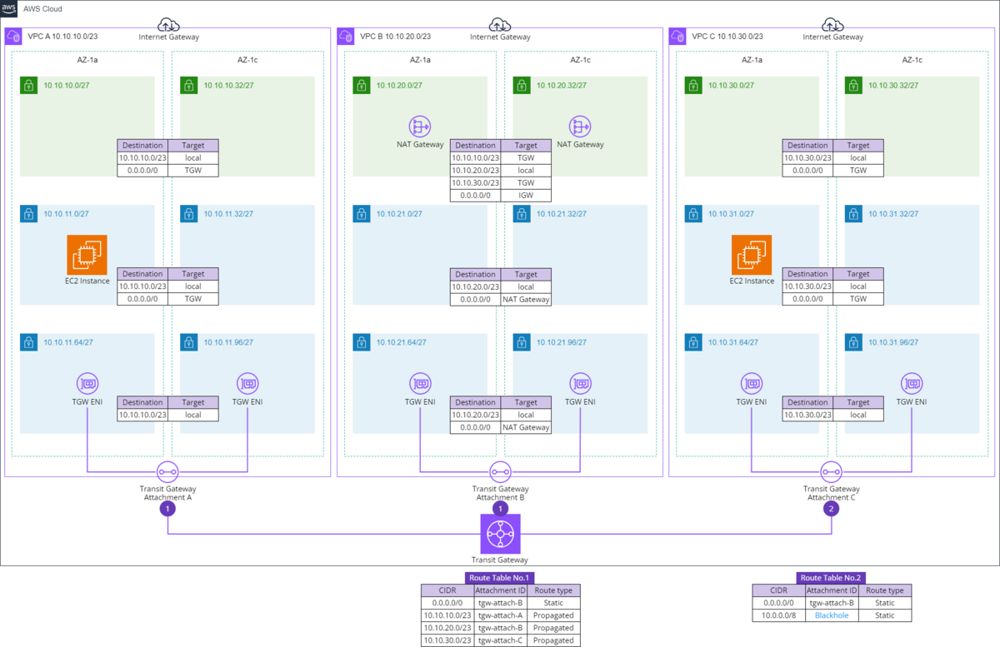

## VPCエンドポイントポリシー
### 特定のモデルIDのみを許可
```
{
    "Statement": [
        {
            "Action": [
                "bedrock:InvokeModel"
            ],
            "Resource": [
                "arn:aws:bedrock:{リージョン}::foundation-model/{モデルID}"    
            ]
            "Effect": "Allow",
            "Principal": "*"
        }
    ]
}
```

## Transit GatewayでNAT集約
### 要件
- 「VPC A」と「VPC C」は「VPC B」のNAT Gatewayを使用してインターネットアクセスする


## Transit GatewayでVPC間通信を制限
### 要件
- 「VPC A」⇔「VPC B」同士の接続が可能

- 「VPC A」⇔「VPC C」同士の接続は不可能

- 「VPC B」⇔「VPC C」同士の接続は不可能、ただし「VPC C」から「VPC B」の NAT Gateway へは接続が可能であること


## Transit Gateway + VPN(Strongswan)
### VPNインスタンス作成
- Ubuntu
- パブリックサブネット
- Elastic IPを割り当てる


### カスタマーゲートウェイ作成
- IPアドレス→VPNインスタンスのパブリックIP

### Site-to-Site VPN 接続作成
- ターゲットゲートウェイのタイプ:Transit Gateway
- カスタマーゲートウェイ:作成したもの
- ルーティングオプション:静的
- ローカルCIDR:オンプレ側VPCのCIDR
- リモートCIDR:AWS側VPCのCIDR
- 設定をダウンロードする
    - ベンダー:Strongswan

### VPNインスタンスの設定
- strongswanインストール
```
apt update
apt install -y strongswan
```

- ダウンロードした設定ファイル通りに設定する
    - <LOCAL IP> → VPNインスタンスのプライベートIP
    - <VPC CIDR> → AWS側VPCのCIDR
    - <PHYSICAL INTERFACE> → ip a コマンドで表示される物理インターフェース

- インスタンスに紐づくENIの「送信元/送信先チェック」をオフにする

- セキュリティグループ
    - UDP:4500,500を許可
    - カスタムプロトコル:50を許可

### Transit Gatewayの設定
- アタッチメントタイプ:VPN
    - カスタマーゲートウェイ:作成したもの
    - ルーティングオプション:静的

- ルートテーブルを設定する

### VPCルートテーブルの設定
-　送信先(CIDR) →  ターゲット(VPNインスタンス)

## Transit Gatewayアタッチメントをコンプライアンスモード
アタッチメントを変更→「コンプライアンスモードサポート」にチェックをつける

## マルチキャスト
### Transit Gateway作成
「マルチキャストサポート」にチェックをつける

### マルチキャストドメインを作成
「IGMPv2のサポート」にチェックをつける

各サブネットの関連付けを作成する

**※サブネットを複数選択するとエラーが発生するので1つずつ作成

### EC2インスタンスでIGMPのバージョンを強制的に2にする
```
sudo sysctl -w net.ipv4.conf.eth0.force_igmp_version=2
```

### マルチキャストコマンド
```
omping -m <IP①> <IP②> <IP③>
```

## VPCからIPv6でアウトバウンドのみを行う
Egress-only Internet Gatewayを作成し、ルートテーブルのターゲットとして登録する

## Lattice
### 構成
VPC1:ALBでflask

VPC2:Lambda

VPC3:ECSでflask(ポート8080)

### 前提条件
VPC1のALBのSGでlatticeのプレフィックスリストからのHTTP許可

VPC3のタスクのSGでlatticeのプレフィックスリストからの8080許可

### ターゲットグループ作成
#### VPC1
ターゲットタイプ:ALB

プロトコル:HTTP

ポート:80

VPC:VPC1

#### VPC2
ターゲットタイプ:Lambda

#### VPC3
ECSのサービス作成画面からターゲットグループを作成


### Latticeサービスを作成
#### ルーティングを定義
プロトコル:HTTPS

ポート:443

ターゲットグループ:各ターゲットグループ

### サービスネットワークを作成
各サービスを関連付ける

サービスにアクセスするVPCをVPCの関連付けで指定する

**関連付けられたVPCからドメインにアクセスする**

## トラフィックミラーリング
### 構成
モニター用インスタンス、インスタンス①、インスタンス②

### 前提条件
#### モニター用インスタンスのセキュリティグループのインバウンドルール
4789番(XVLAN)を許可する

インスタンス①→インスタンス②の通信をモニター用インスタンスで監視する

### トラフィックミラーターゲットを作成
ターゲット:モニター用インスタンスのENI

### ミラーフィルターを作成
インバウンド、アウトバウンド全許可

### ミラーセッション作成
ミラーソース:インスタンス①

ミラーターゲット:インスタンス②

セッション数1

フィルタ:作成したミラーフィルター

### キャプチャコマンド
```
tcpdump -A icmp
```

## Network Access Analyzer
**※VPC内で、設定が意図した通りになっているかを確認するための機能**

「Network Manager」→「Network Access Analyzer」
