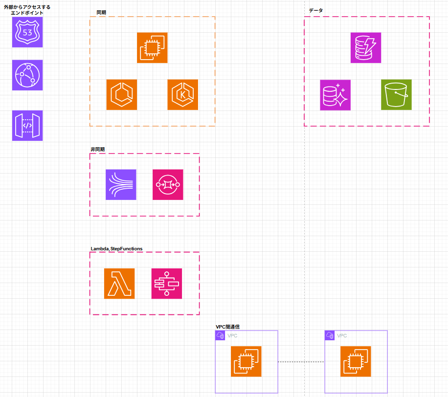

## ① 同期パターン（Sync）

### 構成イメージ
```
Client → Endpoint → App(Compute) → DB → Response
```

### 構築手順（優先度順）
1. コンピューティングリソースを作成
2. データベースを作成
3. アプリを起動
4. アプリとデータベースの接続確認
5. エンドポイントを作成
6. リクエストが成功することを確認（最小ロジック）
7. 細かいビジネスロジックを設定

### ポイント
- 最初は疎通確認レベルで十分
- ロジックの作り込みは後回し

---

## ② 非同期パターン（Queue）

### 構成イメージ
```
Client → Endpoint → Queue
                     ↓
                Worker / Lambda
```

### 構築手順（優先度順）
1. キューを作成
2. エンドポイントを作成
3. エンドポイントからキューにリクエストを送る設定
4. リクエスト成功 & キュー到達を確認
5. キュー受信後の処理ロジックを設定

### ポイント
- 成功の定義は「キューに投入されたこと」
- DLQ（デッドレターキュー）も検討

---

## ③ Lambda / Step Functions パターン
### 構成イメージ
```
Client → Endpoint → Lambda,Step Functions
```

### 構築手順（優先度順）
1. Lambda / Step Functions リソースを作成
2. とりあえず成功レスポンスを返す実装
3. エンドポイントを作成
4. リクエストが成功することを確認
5. 細かいロジックを設定

### ポイント
- Lambda,Step Functionsでとりあえず成功レスポンスを返す実装をする

---

## ④ VPC間通信パターン
### 構成イメージ
```
VPC-A (App) ⇔ VPC-B (DB / Service)
        ↑
     Endpoint
```

### 構築手順（優先度順）
1. VPCを作成
2. コンピューティングリソース・データベースを作成
3. VPC間通信（Peering / PrivateLink 等）を設定
4. 別VPCリソースへの接続確認
5. エンドポイントを作成
6. リクエストが成功することを確認

### ポイント
- VPC設計は後戻りコストが高い
- 先にネットワークを固める

---

## パターン共通の考え方

### 構築優先順位
1. 成功レスポンスを返せる状態を作る
2. 疎通確認（最小構成）
3. 後続処理の安全な実装
4. 詳細ロジックの追加
